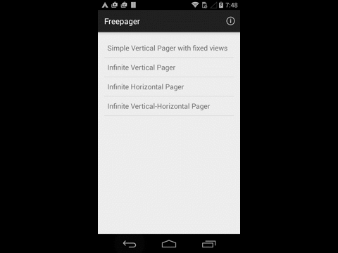

[](https://android-arsenal.com/details/1/1478)
# freepager 

#### Ready-to-use view pagers for your project. 

Based on [Swipes navigation demo repository](https://bitbucket.org/NxAlex/swipes-navigation-demo)



### Usage:

#### Gradle:

```

dependencies {
    compile 'pro.alexzaitsev:freepager:1.0.1'
}

```

*For a working implementation look at the ```sample``` module*

* `Vertical Pager` with fixed views count:

    [Preview](https://github.com/alexzaitsev/freepager/blob/master/01.gif)  
    [FixedViewsFragment.java](https://github.com/alexzaitsev/freepager/blob/master/sample/src/main/java/pro/alexzaitsev/freepager/sample/FixedViewsFragment.java)  
    [fragment_fixed_views.xml](https://github.com/alexzaitsev/freepager/blob/master/sample/src/main/res/layout/fragment_fixed_views.xml)

* `Infinite Vertical Pager`:

    [Preview](https://github.com/alexzaitsev/freepager/blob/master/02.gif)  
    [InfiniteVerticalFragment.java](https://github.com/alexzaitsev/freepager/blob/master/sample/src/main/java/pro/alexzaitsev/freepager/sample/InfiniteVerticalFragment.java)  
    [fragment_infinite_vertical.xml](https://github.com/alexzaitsev/freepager/blob/master/sample/src/main/res/layout/fragment_infinite_vertical.xml)

* `Infinite Horizontal Pager`:

    [Preview](https://github.com/alexzaitsev/freepager/blob/master/03.gif)  
    [InfiniteHorizontalFragment.java](https://github.com/alexzaitsev/freepager/blob/master/sample/src/main/java/pro/alexzaitsev/freepager/sample/InfiniteHorizontalFragment.java)  
    [fragment_infinite_horizontal.xml](https://github.com/alexzaitsev/freepager/blob/master/sample/src/main/res/layout/fragment_infinite_horizontal.xml)  

* `Infinite Free Pager` (both horizontal and vertical directions):

    [Preview](https://github.com/alexzaitsev/freepager/blob/master/04.gif)  
    [FreeFragment.java](https://github.com/alexzaitsev/freepager/blob/master/sample/src/main/java/pro/alexzaitsev/freepager/sample/FreeFragment.java)  
    [fragment_infinite_vertical.xml](https://github.com/alexzaitsev/freepager/blob/master/sample/src/main/res/layout/fragment_infinite_vertical.xml)  

## Compatibility

  * Android 2.1.x (API 7) +

# Changelog

### Version: 1.0.1

  * Class duplicates are removed

### Version: 1.0

  * Pilot version

## License

    Copyright 2015, Alex Zaitsev

    Licensed under the Apache License, Version 2.0 (the "License");
    you may not use this file except in compliance with the License.
    You may obtain a copy of the License at

       http://www.apache.org/licenses/LICENSE-2.0

    Unless required by applicable law or agreed to in writing, software
    distributed under the License is distributed on an "AS IS" BASIS,
    WITHOUT WARRANTIES OR CONDITIONS OF ANY KIND, either express or implied.
    See the License for the specific language governing permissions and
    limitations under the License.
